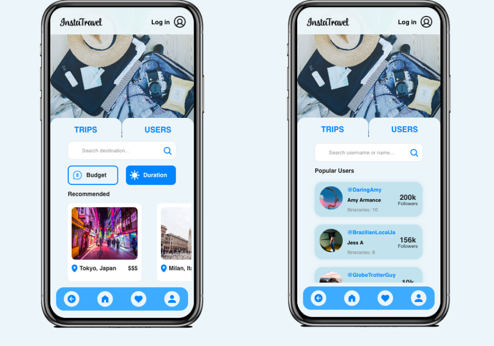
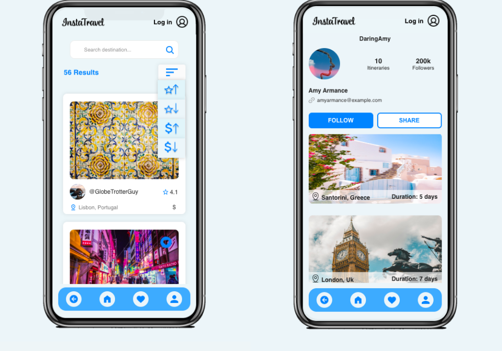
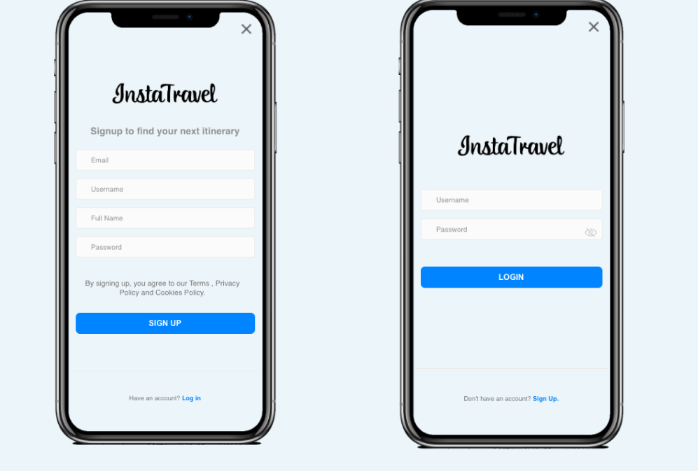
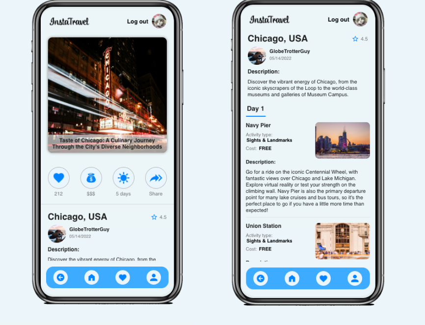
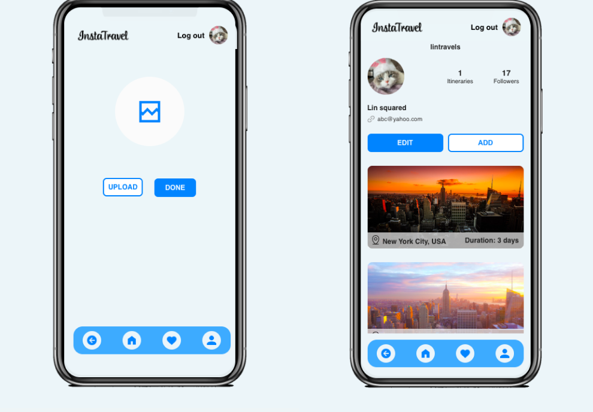
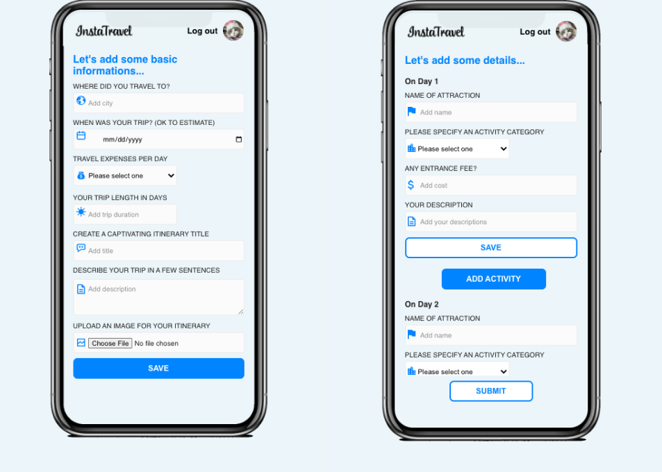

# InstaTravel

InstaTravel is an innovative web application designed to help people who dislike planning trips. It allows users to choose from a wide selection of pre-existing itineraries submitted by other travelers on the app. This app makes it easy for you to follow itineraries uploaded by your favorite bloggers, influencers, and friends. In addition, it provides a platform for travelers to share their past itineraries with others, making them easily accessible and shareable. With a diverse selection of itineraries to choose from, you can pick one that suits your interests and style. So, stop planning and start traveling!

## Table of Content
- Features and user Flow
- Installation
- End Points
- Conclusion

## Features
- Select an itinerary by browsing the recommended section or a specific city
- Select itineraries created by popular or favorite users
- Filter itineraries based on user's budget and duration
- Sort itineraires based on itinerary's rating or budget set
- Select a specific itinerary to view all the detailed activities and information included in it
- View a specific traveler's profile to access all the itineraries they have submitted
- Create an account and login into your account 
- Start creating your own itinerary or browse and save your favorite itineraries


## User Flow

<p align="left">
 <br>Home page with Trips and Users tabs. Users can explore featured trips and browse user profiles.<br><br>
  
<br><br>Search by itineraries and User profiles. Users can search for specific itineraries and view other user profiles.<br><br>
  
<br><br>Signup & Login. Users can create an account and login to access personalized features.<br><br>

<br><br>View a detailed itinerary. Users can view all the details of a specific itinerary, including descriptions, activities, costs and travel tips.<br><br>

<br><br>User profile and profile image upload page. Users can upload a profile picture and manage their profile information.<br><br>

<br><br>Adding a new itinerary by user. Users can create and submit their own travel itineraries to share with others.<br><br>

</p>


### Installation

1. Clone both front-end and back-end repository: 
- git clone https://github.com/linsquared/instaTravel-client 
- git clone https://github.com/linsquared/instaTravel-backend
2. Install the dependencies: npm install
3. Set up the database: mysql -u root -p
4. Create database CREATE DATABASE capstone
5. Once you have a database to use, update the knexfile.js with your user, password, and database information.
6. Create a .env file based on .env.example, and update your password information
7. Start the client: npm start
8. Start the server: npx nodemon index.js

## Endpoints

#### Table 2: 2itinerary
GET /itineraries
##### Functionality: Get a list of all itineraries
Response body example
```json
[
{
"itinerary_id": "1056829374",
"user_id": "4976132085",
"user_name": "GlobeTrotterGuy",
"user_icon": "http://localhost:8080/images/users/Luke.jpg",
"city": "Lisbon, Portugal",
"budget": "$",
"views": 567,
"likes": 213,
"ratings": 4.1,
"duration": 5,
"city_img": "http://localhost:8080/images/cities/lisbon2.jpg",
"description": "Explore Lisbon's vibrant street art scene, from the colorful murals and graffiti adorning the city's alleys and buildings to the contemporary galleries and art festivals showcasing the best of urban art. Discover the diverse styles and voices of Lisbon's street art and the messages they convey.",
"date": "04/12/2019",
"trip_title": "Discovering Lisbon's Street Art: A Tour of the City's Vibrant Murals and Graffiti"
},
{
"itinerary_id": "1208376945",
"user_id": "6815302947",
"user_name": "WanderingWave",
"user_icon": "http://localhost:8080/images/users/maya.jpg",
"city": "Tokyo, Japan",
"budget": "$$$",
"views": 789,
"likes": 45,
"ratings": 4.7,
"duration": 3,
"city_img": "http://localhost:8080/images/cities/tokyo2.jpg",
"description": "With a population of over 13 million, Tokyo is one of the world's largest cities, offering visitors an endless array of activities and experiences. From its world-class museums and art galleries to its vibrant nightlife and diverse culinary scene, Tokyo has something for everyone.",
"date": "03/11/2018",
"trip_title": "Tokyo: Where Tradition Meets Technology"
}
]
```

#### Table 2: 2itinerary
GET /itineraries/:city
##### Functionality: Get a list of itineraries in desired city (ex: chicago)
Response body example
```json 
[
{
"itinerary_id": "1248630975",
"user_name": "GlobeTrotterGuy",
"user_icon": "http://localhost:8080/images/users/Luke.jpg",
"city": "Chicago, USA",
"budget": "$$$",
"views": 563,
"likes": 212,
"ratings": 4.5,
"duration": 5,
"trip_title": "Taste of Chicago: A Culinary Journey Through the City's Diverse Neighborhoods",
"description": "Discover the vibrant energy of Chicago, from the iconic skyscrapers of the Loop to the world-class museums and galleries of Museum Campus.",
"date": "05/14/2022"
},
{
"itinerary_id": "3560829147",
"user_name": "WanderingWave",
"user_icon": "http://localhost:8080/images/users/maya.jpg",
"city": "Chicago, USA",
"budget": "$$",
"views": 7890,
"likes": 567,
"ratings": 3.9,
"duration": 3,
"trip_title": "The Windy City Adventure: Exploring the Best of Chicago",
"description": "Discover the vibrant energy of Chicago, from the iconic skyscrapers of the Loop to the world-class museums and galleries of Museum Campus.",
"date": "07/17/2021"
}
]

```
#### Table 2: 2itinerary
GET /itineraries/id/:itineraryId
##### Functionality: Get details of a specific itinerary (ex:nyc)
Response body example
```json
[
{
"day_id": "X3R5Z0D1V7",
"day": "1",
"activity": [
{
"cost": "FREE",
"activity_id": "nyc-4455667788990",
"activity_name": "The High Line",
"activity_type": "Parks",
"activity_image": "",
"activity_description": "Stroll along the High Line, a beautiful elevated park that runs along the west side of Manhattan and offers stunning views of the city."
},
{
"cost": "$25 - $85",
"activity_id": "nyc-5566778899001",
"activity_name": "Apollo Theater",
"activity_type": "Theaters",
"activity_image": "",
"activity_description": "Experience the magic of the Apollo Theater, a historic venue in Harlem that has hosted some of the biggest names in music and comedy."
},
{
"cost": "$23 - $33",
"activity_id": "nyc-8899001122334",
"activity_name": "American Museum of Natural History",
"activity_type": "Science Museums",
"activity_image": "",
"activity_description": "Discover the wonders of the natural world at the American Museum of Natural History, one of the largest and most celebrated museums in the world."
}
]
}
]
```
#### Table 1: 1users
GET /users
##### Functionality: Get full list of exisiting users
Response body example
```json
[
{
"user_id": "1582973460",
"user_name": "ZonningoutZ",
"user_icon": "http://localhost:8080/images/users/zesty.png",
"author": "Zesty Zhao",
"itinerary_count": 1,
"followers": "3",
"email": "zesty.zhao@example.com"
},
{
"user_id": "2950384167",
"user_name": "TumblingTom",
"user_icon": "http://localhost:8080/images/users/tommy.jpg",
"author": "Tommy Tom",
"itinerary_count": 2,
"followers": "46",
"email": "DoubleTom@example.com"
}
]
```
#### Table 1: 1users
GET /users/:user
##### Functionality: Get user info of a specific user by name or username (ex: amy armance or daringamy)

Response body example
```json
[
{
"user_id": "9025687431",
"user_name": "DaringAmy",
"user_icon": "http://localhost:8080/images/users/amy.png",
"author": "Amy Armance",
"itinerary_count": 10,
"followers": "200k",
"email": "amyarmance@example.com"
}
]
```

## Errors
This API may return different 400 or 404 error

```json
{
  "message": "Error retrieving itinerary"
}

{
  "message": "Error retrieving user"
}
```

## Conclusion
Tech Stack Front-end: [React] [SAAS] [Axios] <br>
Tech Stack Back-end: [Node JS] [Express] [cors] [knex] [mySQL] [mySQL Workbench] [Cloudinary] [Multer]

### Lessons learned and next steps

While developing this project, I encountered several challenges that allowed me to strengthen the new skills I have acquired over the past three months. It emphasized the importance of staying flexible and adaptable in the face of unexpected obstacles. By maintaining flexibility, I was able to overcome these challenges and find creative solutions.

Moving forward, there are a few key areas of focus for further development of this project. Firstly, I plan to make the site responsive, ensuring optimal user experience across different devices and screen sizes. Additionally, I aim to expand the range of features offered by the app, enhancing its functionality and usability.
